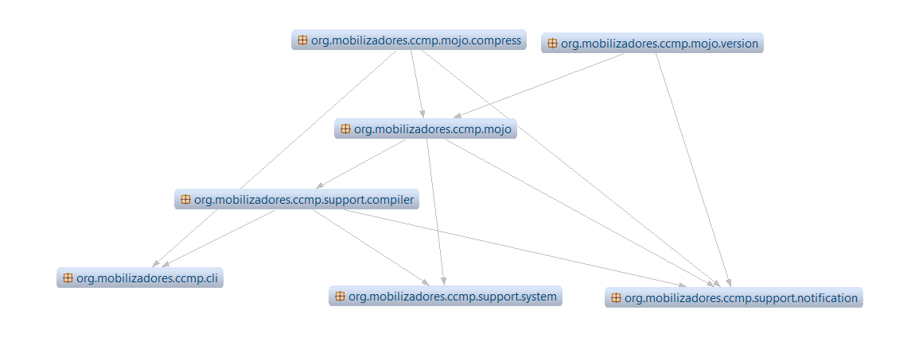

# Google Closure Compiler Maven Plugin (GCCMP)

[Description](#description)

[Historic context](#context)

[Plugin Usage](#usage)

[Plugin Arch & Design](#design)


## Description<div id="description"/>

The Maven plugin for integrating [Google Closure Compiler (GCC)](https://developers.google.com/closure/compiler) into application build was implemented as an alternative to YUI compressor, which was being primarily used in my first personal project, Mobilizadores.org. Both are written in Java, which facilitates the integration with Maven and Java projects. Mavem Plugin GCCMP provides optimization of javascript code in the project build process, by integrating Google Closure Compiler into the project. Beyond minification and obfuscation, GCC transpiles modern JavaScript code (often written using the latest ECMAScript features) into an older, widely supported JavaScript version.

## Historic context<div id="context"/>

In 2000's, as web applications became larger and more sophisticated, concerns about the size of JavaScript files and code readability and security began to surface. This led to a growing interest in minification and obfuscation. In 2007, Yahoo! introduced the Java based YUI Compressor: an open-source tool for JavaScript minification and obfuscation. It became widely known and used in the web development community and integrated not just in Java projects but even in PHP frameworks like Symfony. 

Although during this period the most popular approach in Java projects was typically to use frameworks that generated JavaScript and CSS code interleaved with HTML<sup>1</sup>, a good amount of projects were already separating javascript and css files from html. While this approach would provide better maintainability and code reusability, the first approach would provide shorter page load time. To address this issue, the code in js and css files should be optimized: pieces utilized in a page would be bundled together and, as stated by YUI team, "omitting as many white space characters as possible, and replacing all local symbols by a 1 (or 2, or 3) letter symbol wherever such a substitution is appropriate". To integrate YUI compressor in Java projects build process, developers used tools like the YUI Maven Plugin.


> _(1) Throughout this period, server side rendering (SSR) was the only dominant paradigm in enterprise web applications development (up to Mid-2010s). Java ecosystem had some popular frameworks to generate complete web pages, such as Struts, JSF and Thymeleaf. These frameworks' syntaxes adhere to the Java EE (current Jakarta EE) JavaServer Pages (JSP) Standard Tag Library (JSTL) and JavaServer Pages Expression Language (EL) standards and use Servlet API to access server-side variables and context. Under the hood, these frameworks would make use of javascript libraries, like JQuery, to provide common client-side functionalities, like a form button with user feedback - that could scale up on hover or focus and animate on click, for example - and user triggered XMLHttpRequest for form submission. In the compiled web pages, html was interspersed with javascript, with little to no concern on minification and obfuscation of code._


While client side applications and SPA's paradigms emerged<sup>2</sup>, YUI compressor fell on popularity and was discontinued in August 2014. Various solutions for optimizing 
js code coexisted by the time, including Google Closure Compiler, Terser and UglifyJs, but the community didn't provide Maven integration for any of them, due to change of focus to standalone client-side applications. Most dev teams would either stick with the last version of YUI compressor plugin, or migrate to a client side approach for web pages.

This Google Closure Compiler Maven Plugin came as a quick replacement for YUI Maven Plugin, in the project Mobilizadores.org.

> _(2) From mid 2010's The adoption of ES6 modules became more common in JavaScript development, in conjuntion with asynchronous loading or deferred loading of JavaScript files, which allows the browser to load JavaScript files in parallel with the page, without blocking rendering. Java frameworks like Thymeleaf and Spring MVC started supporting ES6 module syntax, enabling developers to create modular, maintainable JavaScript code._

## Optimizing Js files: Usage<div id="usage"/>

The GCCMP plugin provides the maven goal `compress`that can be configured to bundle scripts according to the configuration passed. The compilation of bundles is multithreaded: the plugin enqueues compilation tasks, awaits tasks termination then report results.

### The easiest way

The quick way to bundle and optimize js code is to list the directories where the input files are and specify the output directory, where the processed files will be dumped. The hierarchies of the input directories are preserved in the output directory, unless the param `jsOutputFile` is specified; in that case, all js files found in the input directories will be in a single bundle.

```
[pom.xml]
...
<build>
    <plugins>
    	<plugin>
    		<groupId>org.mobilizadores</groupId>
    		<artifactId>closure-compiler-maven-plugin</artifactId>
    		<configuration>
    			<inputDirectories>
	    			<inputDirectory>src/test/resources/dir1</inputDirectory>
    			</inputDirectories>
    			<outputDirectory>src/test/resources/output</outputDirectory>
    			<!-- gccmp config params and google compiler options go here -->
    		</configuration>
    		<!-- Execution below can be ommited: default mojo and lifecycle phase are compress in phase prepare_package -->
    		<executions>
    			<execution>
    				<phase>prepare-package</phase>
    				<goals>
    					<goal>compress</goal>
    				</goals>
    			</execution>
    		</executions>
    	</plugin>
    </plugins>
  </build>
  ...
```


#### GCCMP plugin config params<div id='config-params'/>

| Param | &nbsp;&nbsp;&nbsp;&nbsp;&nbsp;&nbsp;&nbsp;&nbsp;&nbsp;&nbsp;&nbsp;&nbsp;Description&nbsp;&nbsp;&nbsp;&nbsp;&nbsp;&nbsp;&nbsp;&nbsp;&nbsp;&nbsp;&nbsp;&nbsp; | Default value |
| ------ | ------ | ------ |
| maxNumberOfThreads | Maximum number of threads to be used by the plugin | 10 |
| inputDirectories | Directories in which the input js files are | |
| outputDirectory | Directory into which processed files will be copied | target/${project.build.finalName}&#13;/WEB-INF/js |
| suffix | Suffix to be added to output files. A common suffix is 'min' | |
| failOnNoInputFilesFound | If the build should fail if an empty input directory is found | true |

#### Google Closure Compiler Options

Supported compiler options 

| Option | Default value |
| ----- | ----- |
| --js (files out of input dirs to be included) | |
| --js_output_file | |
| --language_in | STABLE |
| --language_out | STABLE |
| --js_module_root | |
| --env | |
| --compilation_level` | SIMPLE |
| --logging_level | WARNING |
| --warning_level | QUIET |
| --charset | | 

The list for the compiler options and the description for each of them can be found at https://github.com/google/closure-compiler/wiki/Flags-and-Options. To add a compiler option to the maven plugin configuration, just add the respective underscore case option as camel case. For example: the compiler option `--compilation_level`would be defined in pom configuration as `compilationLevel`.

```
[pom.xml]
...
<plugin>
 		<groupId>org.mobilizadores</groupId>
 		<artifactId>closure-compiler-maven-plugin</artifactId>
 		<configuration>
 			...
 			<compilationLevel>ADVANCED</compilationLevel>
 		</configuration>
 	</plugin>
...
```

Some compiler params, although not required, are suggested to be specified, such as `--js_module_root` and `--externs` [(Externs)](https://developers.google.com/closure/compiler/docs/externs-and-exports). Param `jsModuleRoot` will save bytes, by telling the compiler which part of the file path can be ommited for instance in variables names. Param `externs` is used to list the modules definitions you don't want the compiler to process, but only reference them. A list of externs for popular libraries and how to describe new externs can be found here: https://github.com/google/closure-compiler/wiki/Externs-For-Common-Libraries


```
[pom.xml]
...
<configuration>
	...
	<inputDirectories>
		<inputDirectory>path/to/my/files/1</inputDirectory> 
		<inputDirectory>path/to/my/files/2</inputDirectory> 
	</inputDirectories>
	<moduleRoot>
		<root>path/to/my/files/1</root>
		<root>path/to/my/files/2</root>
	</moduleRoot>
	<externs>
		<extern>src/main/resources/META-INF/resources/WEB-INF/internal/externs/jquery-1.9.extern.js</extern>
		<extern>src/main/resources/META-INF/resources/WEB-INF/internal/externs/i18n.extern.js</extern>
		<extern>src/main/resources/META-INF/resources/WEB-INF/internal/externs/handlebars.extern.js</extern>
	</externs>
	...
</configuration>
...
```

### Overriding default compiler version

To check current compiler version used by the plugin, add the goal `version` to build execution in the pom. If version shown is not the one targeted, you can specify and older or newer version of the compiler by adding it as dependency to GCCMP plugin.

```
[pom.xml]
...
<build>
	<plugins>
		<plugin>
			<groupId>org.mobilizadores</groupId>
			<artifactId>closure-compiler-maven-plugin</artifactId>
			<configuration></configuration>
			<dependencies>
				<dependency>
					<groupId>com.google.javascript</groupId>
					<artifactId>closure-compiler</artifactId>
					<version>v20190909</version>
				</dependency>
			</dependencies>
		</plugin>
	</plugins>
</build>
...
```

## Plugin Design<div id="design"/>



#### Simple Execution Flow
 
- Maven injects configured and default values into the mojo instance. 
- Currently there are two Mojos implemented: compress and version. Each mojo delegates the execution of `Mojo.execute` method to a MojoExecutor. `GCCMP AbstractMojoExecutor` implements MojoExecutor and provides multi-threading support for compilation and custom logging(Notifier) capabilities.
- The `GCCMP AbstractMojoExecutor` expects a mojo of type `T extends ClosureCompilerMojo`in its constructor and an implementation for the method `getCommandList()` which constructs a list of commands to be passed to the compiler. 
- CompressMojoExecutor uses `GCCMP CommandLineHelper`, which leverages Java's Reflection features, to assemble the list of commands, from mojo values, which will be passed to the compiler - the list will have one element, in case `jsOutputFile`is specified. 
- For each command a new task(`GCCMP RunnableClosureCompiler`) is scheduled. Each task has an instance of `MavenCommandLineRunner`- which extends google compiler `com.google.javascript.jscomp.CommandLineRunner` - which has the effective implementation of `run`method.

#### Multi thread support

Tasks executions are managed by `GCCMP ExecutionEvironment`. The class contains a) the system SecurityManager, b) a thread Lock and c) a fixed thread pool (`Java's ExecutorService`). New non daemon threads are created, named<sup>4</sup> and grouped(`jscomp`) through `GCCMP JscompGroupThreadFactory`, with foreground priority _Normal_(5/10). The executor service will receive the list of runnable commands once, then call `shutdown`, so it won't accept new tasks. The executor is set to wait up to 10 seconds for all scheduled tasks to be finished, before forcing termination.

a) Closure Compiler attempts to exit the system after any command is ran. To avoid this, the singleton `GCCMP ContextHoldingSecurityManager` is set as system's security manager. It only allows system exit, if the thread attempting is not from the group `jscomp` and system is enabled, after all compilation tasks are finished.

b) `Google's CommandLineRunner` doesn't support multi-threading on the first step - reading `mixedJsSources` and init configuration - then this needs to be synchronized. `GCCMP RunnableClosureCompiler` releases the lock after that step, so the compilation is ran asynchronously. It is used `Java's ReentrantLock` allowing the same thread to reacquire the lock without deadlocking itself.

c) The thread pool is started with the maximum number of threads specified through plugin config param [maxNumberOfThreads](#config-params). Java's fixed thread pool implementation uses a LinkedBlockingQueue to enqueue the excess tasks up until a thread becomes available to be reused.

> _(4) Java's AtomicInteger is used to ensure that even in a multi-threaded environment, the numbers are generated atomically without conflicts. This is crucial for ensuring thread name uniqueness._

#### Logging

By default the compiler logs information as files are processed. The plugin makes it easier to check possible errors and warnings by logging entries only after all tasks are finished, according to logging level configured; this is implemented by `GCCMP DelayedInternalStream`(PrintStream) class, which is passed to the compiler.

The same log information can be observed by other implementations; this has been particularly useful for testing. The plugin leverages java's default implementation for Observer pattern<sup>3</sup>. `GCCMP RunnableClosureCompiler` is an Observable and notify observers by sending a `Notification` containing description, taskStatus (success, error or info) and command args.

> _(3) Observer implementation has been deprecated since jdk9, but still not removed - current version: jdk17_

### Unit and Integration Tests

It is being used JUnit and Maven Test-Harness for both unit and integration tests. Unit tests are performed for support classes. Mojos are tested in integration level. To test mojo `compress`, the directory `test/resources` contains js source files which serve as input files to be optimized; each batch of tests uses a different pom file in `test/resources/its`. Observers are registered through ExecutionEvironment in a synchronized Set built from `Java's ConcurrentHashMap`, which is a Notifier and the notifications are checked/asserted as they arrive.


