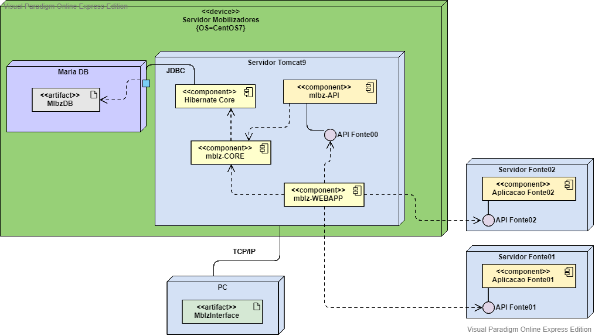
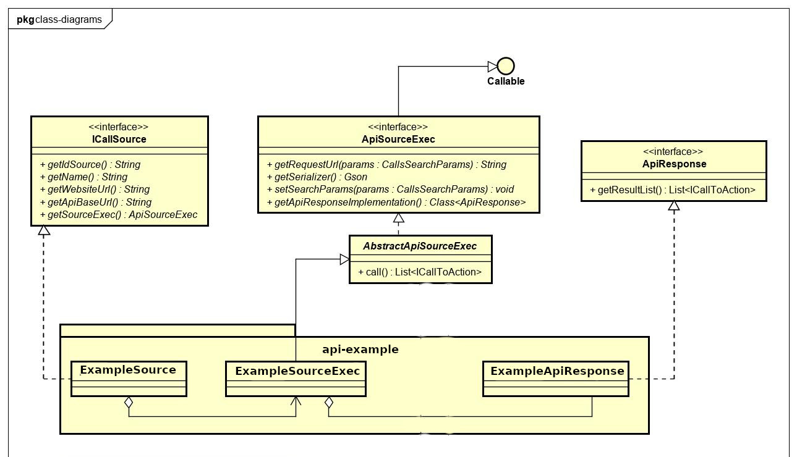
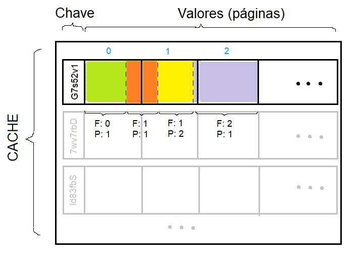
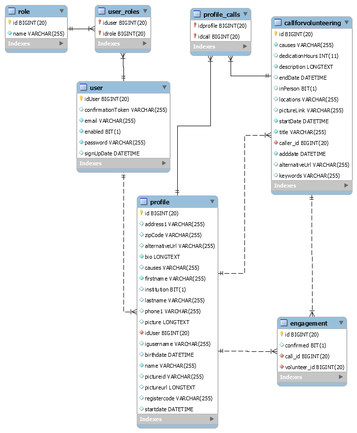

# Mobilizadores

`Mobilizadores.org` (MBLZ) was a web application that worked as an aggregator for opportunities in the [third sector](https://en.wikipedia.org/wiki/Voluntary_sector) **worldwide**. The main features of the application are **a)** custom search of opportunities, which are stored in diverse platforms, including MBLZ itself; and **b)** create a mblz account and post opportunities.

To search and display other services' opportunities or positions, it consumes the services API's, like [Idealist](https://www.idealist.org), [VolunteerMatch](https://www.volunteermatch.org/), [Atados](https://www.atados.com.br) and others. Although almost all of the API's on the numerous services for third sector positions (TSP) are not documented, it's easy to list their available endpoints and parameters just by looking at the network log in a browser's web developer tool.

[Architecture](#arch)

[Searching multiple data sources](#external)

[Data (Model and Processing)](#data)

[Presentation Layer](#presentation)

## Architecture 

Mobilizadores (MBLZ) is a Java application, comprised of the Maven modules listed below. 

* **Core** (mblz-core): Contains **1)** Common configuration: Security, Cache, Web and Persistence configurations; and **2)** Modules' common features: Authentication handler, database based, Message sender, Language utilities, Web model (JsonObjectSerializeDecorator, MessageOutcome, PageMetadata and CallSearchParams), Caching strategy and Markup validation. Makes use of Spring framework, aspects, context-support, security-web, security-config.

* **Mblz Model** (mblz-model): Contains object relational model related to internal MBLZ's data set. External models are translated to this model. Properties are properly mapped, through annotations, to respective database tables' columns, as well as mapped constraints for validation (JSR 380) and for serialization.

* **External Sources Mapping** (mblz-connect): Provides interfaces and abstract implementations to be followed by external sources of data. More on section [Searching multiple data sources](#external)

* **Data** (mblz-data): This module takes care of accessing database and dealing with transactions. SQL's are generated by Hibernate, given the mapped model and the use of Hql. Makes use of Spring transaction and orm. More on section [MBLZ Data (Model and Processing)](#data)

* **Own Endpoints and respective Services** (mblz-csp): Handles http requests and builds response, through controllers, which call proper services to process business logic. The main resources provided are User, Profile and Call for Volunteering. An extra endpoint/service provided, which is private, is the Files Service, which handles the upload of files to MBLZ's Google Drive. The configuration for packaging - as web application archive (war) - also resides in this project's object model(pom) file. Uses Spring webmvc.

* **Web Application** (mblz-webapp): This module includes the files for view rendering and client-side scripting: jsp's, scripts and stylesheets. More details in section: [MBLZ Presentation Layer](#presentation)

* **Packaging** (mblz-pom): This module is meant to centralize common maven configuration and libraries through a parent pom file. Common configuration includes compilation level, libraries' versions, source encoding, etc. Common libraries include frameworks like spring-mvc, which includes various functionalities, from http request handling to frontend java tags.

The system relationship between these modules can be seen in the following diagram:

## Searching multiple data sources 

An abstract layer performs common tasks, like fetching data, using standard java.net http connection to GET data from external sources. MBLZ is extensible [...] Each source implementation must provide: **1)** a deserializer, which defines: whether property names in json response are camel-case or underscore, whether some specific properties should be ignored, etc; and **2)** a request url with the translated query params, from mblz query params to external api's params.

The requests for searching the data sources are sent in parallel. The results which will compose the first page(s) come from MBLZ database. Given the size of the page to be filled  with the results, if not enough results are found to fill it in, results from other sources are used. Results metadata1, like the url's for the resources, is cached, allowing the user to request previous pages and these are returned quickly. When the user requests going to next page, the search is performed from the last data source searched. Upon reaching the last result, from the last available source, the search is considered finished.

> _(1) Each volunteering opportunity/position is called in mblz model `CallForVolunteering`. A custom caching strategy was implemented by creating a simple cache entry processor - Java standard caching API (JSR-107, Jcache). The cache provider, cache manager and configuration are. A bean for `javax.cache.Cache`is provided in spring cache configuration and injected in the service `CallForVolunteeringService` so anytime a search is performed, cache is quickly checked for metadata using this instance. The provider for caching added to classpath is Hibernate's implementation of [EhCache](https://www.ehcache.org)._ 

## MBLZ Data (Model and Processing) 

Mobilizadores takes a relational approach to map data. The main data entities are: CallForVolunteering, Engagement, Profile and User. Their relationship is presented in the diagram below:

These entities/tables are coded as pojos mapped using Hibernate Eager Fetch, to have as few trips to database as possible, when searching for data2. Second level cache is enabled - so beyond having fewer trips to database, we can share data through sessions - for CallForVolunteering and Profile with cache concurrency strategy READ_WRITE3 and factory EhCacheRegionFactory, preferred over Shared(SigletonRegion) for less contention on concurrency, less memory comsumption and ease of data consistency maintenance and invalidating cache. Both entities are configured in `ehcache.xml` to have a maximum of a thousand instances in memory. No queries are cached, although this strategy could be set and monitored to check whether the number of database hits decrease and the percentage of data presented that is outdated.

> *(2) Fetching too much data eagerly can actually sometimes lead to the "N+1 query" problem, where multiple queries are issued when traversing a collection of entities. For fine-grained control over fetching strategies and to avoid potential performance problems, newer versions of the application should mix EAGER and LAZY fetching strategies and use features like the Hibernate JOIN FETCH clause to specify which associations should be eagerly loaded in specific queries.*

> *(3) READ_WRITE strategy reduces potential of stale data compared to NONSCTRICT_READ_WRITE by using cached ‘soft’ locks, which are each released after respective transaction is committed. Locking can cause contention due to slower transaction processing. Stale data can still be caused in scenarios of high contention: all read transactions that access soft-locked entries will fetch the corresponding data directly from the database, therefore the read can occur in between the time a write transaction modifies the data and commits its changes. Although strategy TRANSACTION(optimistic lock) has a more complex setup, if contention noticeably compromise performance, it should be worth avoiding stale data by using this strategy, while monitoring if either performance stays the same or decreased due to frequent version/timestamp check*

## MBLZ Presentation Layer 

Web pages are assembled in a hybrid approach: between server-side and client-side assembling. Application endpoints are mapped(`RequestMapping` path and method) on two types of controllers implemented in module mblz-csp: View controllers and API controllers. The prior return calls with Spring's `ModelAndView` objects, containing the relative path to the template(jsp file) and a model map with page metadata - language, locale, date format - and requested domain objects. The data is added to the page using expression language notation(`${}`). These templates generally don't have images or heavy libs to be loaded, so after the request is answered, the page is deemed loaded; this fast initial load is important for user experience and search engine optimization(SEO).
If the page needs additional data, it is requested with subsequent asynchronous calls, handled by the API controllers. API requests are issued either on load, by using js IIFE's, or on user's actions, which are responded with Spring's `ResponseEntity<String>`. In this case, it is set in RequestMapping response content type as JSON.

The presentation layer is mostly implemented in the module mblz-webapp, but modules core, data and csp have implementation parts of this layer.
Pages share the same basic structure: top navbar, main content and footer. The three parts are pre-compiled templates inserted in the page by using jsp's `%@include` directive. Directory struture is based on resources, each containing respective template, script(js) and style(css). Scripts are split in components - which contain event bindings and post `DomContentLoad` processing - and services with http calls handling and computations as needed.

The heaviest page to be loaded is the most important one: the search and display of volunteer positions. Positions are displayed into html cards, rendered through `Handlebars.js` library, each having title description and background image. The more positions initially loaded, more images are to be loaded. Given that they come from different sources and in different formats, it is better to initially load as few positions as possible and to use some lazy loading technique for the background images not in the viewport, to allow faster full page load and early user interaction4. Page size is being defined in server. A better approach would be to allow client to define page size according to **viewport size**.

_(4) The browser will stop reporting new entries on [largest contentful painting (LCP)](https://web.dev/lazy-loading-images/#effects-on-largest-contentful-paint-lcp) as soon as the user interacts with the page (via a tap, scroll, or keypress), as user interaction often changes what's visible to the user (which is especially true with scrolling)._

